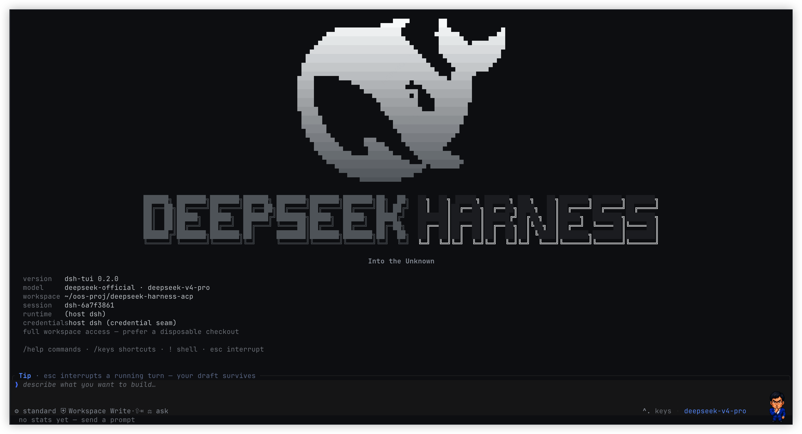
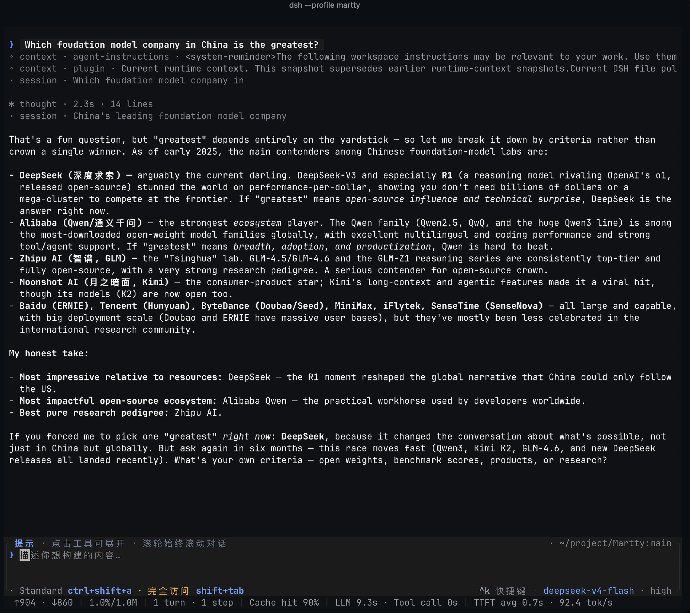
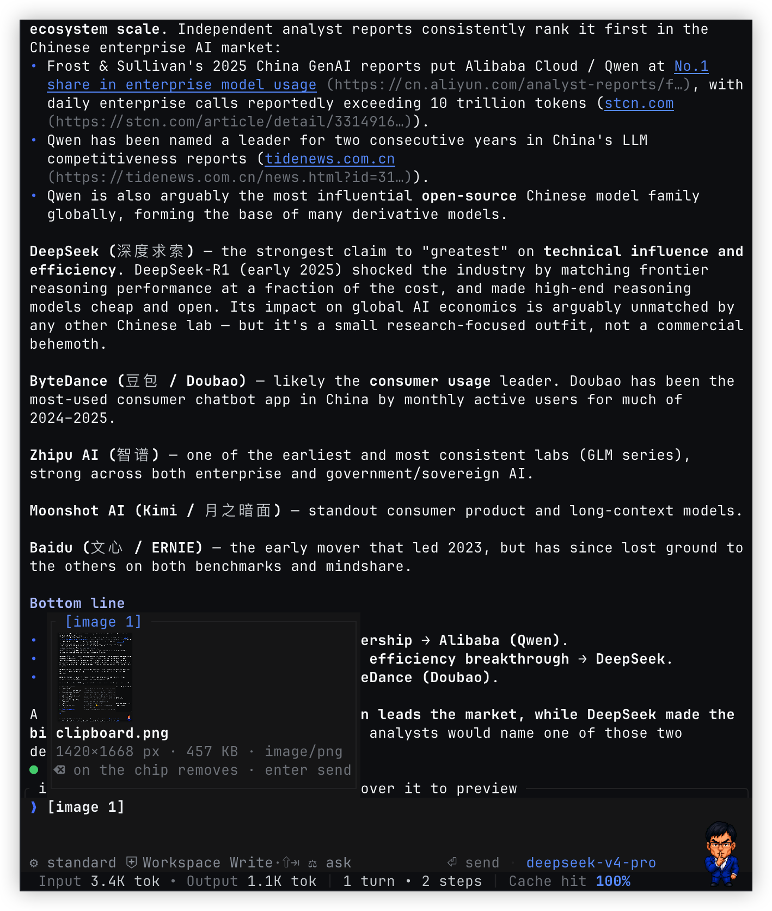
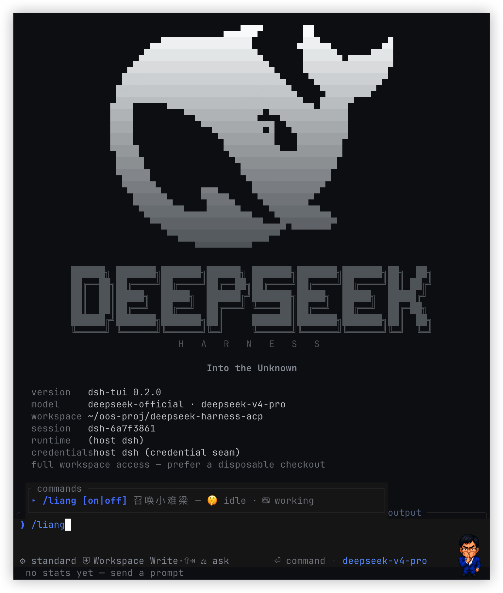

<p align="center">
  
</p>

<h1 align="center">DeepSeek Harness TUI</h1>

<p align="center">
  DeepSeek Harness in your terminal: streamed reasoning, tools, skills, multi-image prompts, and durable sessions.
</p>

<p align="center">
  <a href="README.md">中文</a> · <a href="README.en.md">English</a>
</p>

<p align="center">
  <a href="https://www.npmjs.com/package/martty"></a>
  <a href="https://www.npmjs.com/package/martty"></a>
  <a href="https://github.com/openma-ai/Martty/actions/workflows/package-npm.yml"></a>
  
  <a href="LICENSE"></a>
</p>

---

## Sleek and powerful DSH-TUI

- A high-performance interface written in Rust/ratatui.
- 100% built on official DeepSeek Harness AI capabilities.

`dsh-tui` is a terminal-native ACP client and an extensible terminal on a
Cordis **client** tree. It presents streamed reasoning, tool calls, subagents,
token usage, and durable sessions in a Rust/ratatui interface. The recommended
profile path mounts the ACP plugin on the dsh Base Host tree and starts an
independent TUI Client process; standalone may spawn or attach any ACP agent.
Its long-term direction is not to
hard-wire more features into the TUI, but to compose themes, views, commands,
and interactions as plugins until Creator can inspect, create, run, diagnose,
and iterate on its own terminal capabilities.



## Quick start

### Recommended: dsh TUI surface plugin

Requires Node.js 18+. Install the official
[DeepSeek Harness](https://github.com/deepseek-ai/dsh), then add the TUI
directly to the `tui` profile:

```sh
npm install -g @deepseek-ai/dsh
dsh plugin --profile tui add martty@latest
dsh --profile tui
```

`dsh plugin ... add` is the recommended installation and upgrade entry point.
It creates the profile and installs the TUI plus its ACP dependency; no global
`dsh-tui` or separate pnpm installation is required.
The legacy `@openma/deepseek-harness-tui` name continues to receive the same
versions, so existing installs do not need to migrate immediately.

### Migrating from the legacy package name

`martty` is the new recommended package name. Starting with `0.2.13`, `martty`
and `@openma/deepseek-harness-tui` are published by the same CI run with the
same version and artifacts; the scoped name remains as a compatibility alias.
To switch, replace only the package spec in the `tui` profile:

```sh
dsh plugin --profile tui remove @openma/deepseek-harness-tui
dsh plugin --profile tui add martty@latest
```

Migration does not change the `dsh-tui` / `dsb` commands, the `tui` profile
name, or runtime behavior, and it requires no config or session-data migration.
You may continue using the legacy package name if you do not want to switch yet.

An install guide for AI agents: [docs/agent-setup.md](docs/agent-setup.md)

TUI declares ACP as its own runtime dependency. If the target profile already
contains another version through the standard ACP bundle, the package manager
may retain both dependency copies, but the TUI bundle disables that surface's
old provider/transport rows and mounts only the ACP plugin resolved from TUI's
dependency graph. Supported profile compositions therefore do not start two
ACP surfaces, and users do not have to normalize an existing ACP profile first.

To use portable Agent Plugins, Codex plugins, Claude Code plugins, or Pi
packages in TUI, add the
[Agent Plugins Bridge](https://github.com/openma-ai/dsh-agents-plugins-bridge) to the
same profile:

```sh
dsh plugin --profile tui add @openma/dsh-agents-plugins-bridge@latest
```

Bridge hooks, skills, commands, MCP connections, agents, monitors, and Pi
extensions are shared Host capabilities; commands and skills reach the TUI
slash menu through ACP. The Web settings panel, browser themes, and MCP Apps
HTML renderer remain Web surfaces rather than a second terminal UI.

### Standalone: any ACP agent

```sh
dsh-tui --agent dsh-acp
dsh-tui --agent dsh --agent-arg --profile --agent-arg acp
```

From this checkout (need `cargo build --release` or `scripts/build-npm.sh`, binary in `npm/vendor/<platform>/`, or `DSH_TUI_BIN`):

```sh
DSH_TUI_BIN=$(pwd)/target/release/dsh-tui dsh-tui --agent dsh-acp
```

### Martty owner: long-lived headless ACP / Pi RPC

`martty owner` is a generic long-lived ACP client with no TUI. It opens a real
Session with an explicit `rpc` interaction mode, waits until the Session
advertises each slash command, runs startup commands in order, keeps the
Session and extension lifecycle alive, and runs shutdown commands on
`SIGINT`/`SIGTERM`. There is no Telegram-specific production path; any Pi
extension with the same lifecycle semantics can use it.

Prepare a Host-only profile, then import the extension through Web, TUI, or
`/plugin-bridge import <location:key>`:

```sh
npm install --global @openma/deepseek-harness-tui
dsh plugin --profile telegram-owner add @openma/deepseek-harness-acp@latest
dsh plugin --profile telegram-owner add @openma/dsh-agents-plugins-bridge@latest

martty owner \
  --agent dsh \
  --agent-arg --profile \
  --agent-arg telegram-owner \
  --startup-command /telegram-connect \
  --shutdown-command /telegram-disconnect
```

Run `/telegram-setup` once in interactive Pi/TUI for initial `pi-telegram`
configuration. Owner never auto-approves permissions or answers `confirm`,
`input`, or other forms. Stop any Pi/TUI instance that already owns the same
Telegram profile before starting owner; otherwise the extension requests a
takeover and the headless client cancels it with an explicit error. Keep the
`martty owner` process alive under a terminal, launchd, systemd, or another
process supervisor for continuous delivery.

Third-party capabilities are ordinary Cordis plugins on the client tree: they
declare the services they need, register contributions in `apply`, and retract
them with the owning fiber. Themes, the root right rail, local commands, slider
overlays, current ACP Session config transactions, and package-private
Host/Client RPC are open today. See the [plugin API](docs/plugins.en.md) and
[Fully pluggable and self-evolving](#fully-pluggable-and-self-evolving) for the
complete direction. `--demo-skin` merely mounts the gallery pack `ember`; it
does not put theme-specific behavior in core.

### Try the demo first

The demo needs neither a runtime nor an API key:

```sh
npm install --global martty
dsh-tui --demo
```

`dsh-tui` is the interactive command; `martty` is the product alias for the
same native program, and `dsb` remains as a compatibility alias.

## Highlights

- **A complete agent timeline:** stream reasoning, replies, tool arguments and
  results, plugin context, subagent lifecycles, and token/cache metrics. A live
  status line keeps the current phase, elapsed time, and queue depth visible.
- **Native ACP capabilities:** read the agent's models, compositions,
  permissions, authentication methods, and available commands. Skills join
  built-in commands in one searchable, scrolling slash menu.
- **Multi-image prompts:** stage up to eight images from files, the clipboard,
  or paste. Editable `[image n]` chips live inline with the draft and expose a
  preview with name, dimensions, size, and media type.
- **Terminal-aware Markdown:** render headings, lists, quotes, fenced and inline
  code, emphasis, strikethrough, links, and image markers while preserving
  styling across CJK/Latin text and soft wraps.
- **Dense tool views:** tool calls expose running, success, and failure states;
  results collapse to the last four lines and expand inline while the wheel
  always scrolls the conversation.
- **Long-turn control:** queue follow-ups or steer the active turn immediately;
  manage durable JSONL sessions with `/new`, `/resume`, and `--session-id`, with
  workspace mode facts cached across launches.
- **Cross-platform editing:** readline commands, contextual shortcuts, physical
  ⌘/⌥ modifier rescue on macOS, and ctrl conventions on Linux and Windows keep
  movement and deletion consistent across terminals.
- **A terminal-native surface:** dark/light themes, narrow layouts, mouse
  selection and tool interaction, native/tmux/OSC 52 clipboard routing, kitty
  image previews, and the optional `/liang` pixel companion.

<p align="center">
  
</p>

## Fully pluggable and self-evolving

The goal is a small TUI kernel plus composable plugins, not a terminal app that
accumulates product-specific branches. Core owns ACP sessions, the TTY, input
dispatch, layout constraints, and semantic-node rendering. Product capabilities
enter the client tree through Cordis services, slots, and plugin lifecycles.

- **One lifecycle:** static packages and Creator-generated dynamic packages use
  the same Cordis Loader, fibers, `inject`, and disposers. Mounting takes effect
  immediately, while stopping or switching retracts every contribution; there
  is no second "dynamic plugin" runtime.
- **One plugin, several surfaces:** a package may contribute a theme, slots,
  commands, and overlays together, sharing state or coordinating through
  package-private Host/Client RPC. Core adds no Liang-, effort-, or plugin-specific
  branches.
- **Semantic capabilities only:** plugins submit `TuiNode` trees and general
  interaction semantics such as sliders and forms; the Rust renderer adapts them
  to the terminal. Plugins never receive the TTY, raw mode, Ratatui, kitty escape
  sequences, or absolute coordinates. Replacing the renderer must not change the
  plugin ABI.
- **Dynamic preview and durable composition stay separate:** `define/run` drives
  immediate preview, while `stop/update/rollback` owns the live lifecycle; an
  approved Package can then be persisted. `AgentPreset` continues to compose
  agent-side capabilities. A separate future `ViewPreset` will compose Client/UI
  plugins. They may be selected together, but are stored and switched separately.
- **The Creator loop:** Creator inspects the real Host/Client services, slots,
  tokens, and schemas before generating `code.host`, `code.client`, or both. It
  then observes activation and render failures and can repair, update, roll back,
  or save the Package. That loop is "self-evolution"; it is not direct model
  access to terminal internals.

### Current boundary

The ACP client split is in place, together with these primitives on one dynamic
Package lifecycle:

- `tuiTheme` and the single-select `/theme` Plugin seat;
- `tuiSlots`, `chrome.right`, and schema-validated `TuiNode` trees;
- lifecycle-owned local slash commands and native slider overlays;
- a current-Session config directory and transactions projected from standard
  ACP `configOptions`;
- Client inspect/run, Package stop/start/retract, and package-private
  Host/Client RPC;
- a TUI development skill visible only in the Creator preset and registered
  independently of ACP.

Static plugins and dynamic `code.client` packages use the same primitives;
none is a demo-specific side channel. More shell and conversation slots, other
general inputs such as forms, complete runtime diagnostics, and `ViewPreset`
are still being migrated. "Fully pluggable" remains the target architecture.
See the [migration plan](docs/migration.en.md) for phase-by-phase status.

### Compared with the Web plugin platform

| Dimension | Web today | TUI foundation and direction |
|---|---|---|
| Client runtime | Mature React Cordis tree | Node Cordis client tree is in place; Rust remains a semantic renderer, not a third tree |
| UI extension | Typed slot tree across conversations, settings, tool cards, and many other surfaces | `chrome.right` is open today; `tuiSlots` will cover shell and conversation surfaces without exposing terminal coordinates |
| Theme | `ThemeRuntime` registers themes, stacks token overrides, switches at runtime, and persists built-in preferences | `/theme` is a single-select Plugin switch that loads/replaces a Theme Plugin and all of its contributions together |
| Interaction components | Plugins contribute React components | Schema-validated `TuiNode`, local commands, and slider overlays are open; forms and other inputs continue as general terminal semantics |
| Dynamic plugins | Two-half `code.host` + `code.client` Packages share Loader/fiber and support run, stop, update, and rollback | Inspect/run, themes, right rail, commands, overlays, config transactions, and package-private RPC share one DSH Cordis ACP extension; diagnostics and durable composition continue |
| Diagnosis and repair | Client activation and React render failures return to Creator for another revision | The target is the same loop for activation, schema, and paint failures, with update and rollback |
| Presets | `AgentPreset` composes agents; Client plugins persist separately | Keep the AgentPreset boundary and add an independent `ViewPreset` for terminal view composition |

The Web plugin surface is broader and more mature today. TUI aligns with its
Cordis composition, lifecycle, and Creator loop; it does not move React or the
browser DOM into the terminal.

## Runtime architecture

The primary `dsh --profile tui` path mounts the ACP plugin on the Host Base
Cordis tree, then starts a Node Cordis Client tree in a separate process:
`tui-theme` provides the palette
registry, `tui-cordis-client-runner` serves Client inspect/run requests from
`dsh-tool-cordis`, `acp-client` attaches the Host's standard stdin/stdout, and
`dsh-tui-shell` starts the Rust painter and multiplexes messages. The agent (default
Harness) stays on the Host tree; the two Cordis trees only speak ACP. Standalone
`dsh-tui` instead spawns or attaches the configured ACP agent. The Rust painter
is not a third Cordis tree: it owns the TTY, input, and rendering only.

The two Cordis trees do not synchronize plugin ids, `inject`, or fibers.
Standard ACP continues to carry sessions, prompts, authentication,
configuration, and `session/update`. Client capability discovery, dynamic
Package execution, and package-private RPC for self-evolution use a negotiated
ACP extension instead. The target extension is unified under `_dsh/cordis/*`
and advertised through `initialize` `_meta.dsh.cordis`; an ACP agent without
that extension remains fully usable as a regular agent.

Creator guidance remains a separate Host overlay exported by the TUI package;
ACP is its runtime dependency. Users install only the TUI; its bundle mounts
the ACP plugin and Creator overlay on the Base Host tree, while the runner
only starts the TUI Client process. Creator adds `tui-plugin-development` to
the upstream `cordis` preset's standing
scope. It neither copies the preset nor edits upstream files, and skill
discovery and registration do not depend on ACP. Web and TUI therefore use the
same Creator preset.
ACP and the Creator overlay never enter the Client tree, so the full Harness boots only once
in the Host process.

Host↔TUI Client ACP uses the Client child's standard stdin/stdout. Client fd 3/4
only inherits the user TTY and becomes the Rust painter's stdin/stdout; the
Rust child's own fd 3/4 is the Node↔painter compositor channel.

Node and Rust use fds 3/4 on Unix and a token-authenticated loopback TCP socket
on Windows. This private compositor channel only projects semantic paint state,
including themes and `TuiNode` trees. It is neither a plugin API nor an agent
business channel. Generic Cordis inspect/run/lifecycle uses `_dsh/cordis/*`;
painter capabilities such as themes, slots, commands, and overlays use the
`_dsh/cordis/tui/*` child domain. These are underscore-prefixed ACP Extension
Requests/Notifications and never enter prompts or conversation history.

## Essential interactions

| Key / command | Behavior |
|---|---|
| `enter` | Send; queue a follow-up while a turn is running |
| `ctrl+x` | Steer the active turn immediately without cancelling it |
| `esc` | Interrupt the current turn (draft survives); clears the draft when idle |
| `ctrl+c` | Clear the draft first; press twice when idle, five times while a turn runs, to quit; never interrupts the current turn |
| `/` | Open the command menu and filter by prefix; agent-advertised skills join it and still ship as `/name ` prompts |
| `/model` · `/agent` | Pick an agent-advertised model or agent preset; `option+a` cycles agents directly without a picker |
| `/auth` | ACP sign-in (method picker when several methods; otherwise Terminal Auth or `authenticate` `_meta`); mid-session `auth_required` opens the same surface; the agent's `/login` stays a prompt |
| `/permission` · `shift+tab` | Pick or cycle agent-advertised permission modes |
| `/effort` · `/plan` | Set reasoning effort or pass plan mode to the host |
| `/image <path> [text]` | Send a local image (png/jpeg/webp/gif); ACP Image blocks when the agent advertises `promptCapabilities.image`, otherwise `resource_link` |
| `/clip [text]` · `ctrl+v` | Stage the clipboard image (repeatable; up to 8 ride one prompt); macOS/Linux |
| Image chips | Live inline in the draft as `[image n]` tokens (no icon); backspace cuts the whole chip, hover (or park the cursor on) one for a preview popup — kitty thumbnail + dimensions/size/type |
| `ctrl+o` · `ctrl+t` | Expand output · toggle the theme |
| `pgup/pgdn` · `ctrl+u/d` (empty prompt) | Scroll; `end` follows the live tail |
| Readline editing | `home/ctrl+e` line ends · `ctrl+k/u` kill to end/start · `ctrl+w` word back |
| macOS | `⌘←/→` line ends · `⌥←/→` word hops · `⌘⌫` kill to start · `⌥⌫` word back (physical key state read natively — works in every terminal) |
| Linux/Windows | `ctrl+←/→` word hops · `ctrl+⌫` word back |
| Click tool · wheel | Click a tool to expand/collapse it; wheel always scrolls the conversation |
| Mouse drag | Copy on release; double-click a word; `shift+drag` uses native selection |
| `!cmd` | Run a command in the client's session-local shell, outside the agent; the shell starts in the workspace and keeps `cd`, environment variables, and other state for later `!` commands until the TUI exits |

Use `/help` for commands and `/keys` for the complete shortcut list.

<p align="center">
  
</p>

<p align="center">
  
</p>

<details>
<summary><strong>Composer pet: /liang 🤫</strong></summary>

`/liang` places a small pixel-art companion beside the composer: quiet while
idle, typing at a tiny terminal during a turn. Terminals with kitty graphics
protocol support, including Ghostty, Kitty, and WezTerm, get RGBA sprites;
others fall back to a half-block whale. The pet hides below 60 columns.

Use `/liang on` or `/liang off` to control it explicitly.

<p align="center">
  
</p>

</details>

## Build from source

Requires Rust stable and Node.js 18+:

```sh
make rust-test
node --test scripts/package-native.test.mjs
bash scripts/build-npm.sh
```

`make rust-build` / `make rust-test` / `bash scripts/build-npm.sh` go through
`scripts/cargo-guard.sh`. It runs a scoped `cargo clean` first when this
repository's `target` exceeds 20 GiB or free disk falls below 10 GiB.
`make rust-cache-status` is read-only and `make rust-cache-prune` cleans
explicitly; override the thresholds with `RUST_CACHE_MAX_GIB` /
`RUST_DISK_MIN_GIB`.

Use `make tui-test` for the real development profile. It rebuilds
`target/debug/dsh-tui` first, then launches `tui-test` with `DSH_TUI_BIN`, so
Node HMR cannot leave the Rust painter on an older process image.

The local script builds only the current platform and writes a tarball to
`dist/`. The `Package and publish npm` GitHub Actions workflow builds and then
assembles these paths into one npm package:

```text
npm/vendor/darwin-arm64/dsh-tui
npm/vendor/darwin-x64/dsh-tui
npm/vendor/linux-x64/dsh-tui
npm/vendor/win32-x64/dsh-tui.exe
```

Pushing a tag that matches both `npm/package.json` and `Cargo.toml` (for example,
`v0.1.0`) publishes to `latest` through npm Trusted Publishing (OIDC), then
creates a GitHub Release with the tarball. A version mismatch fails before
publishing.

## Troubleshooting

- **`no native binary for ...`**: the installed package does not contain your
  platform. Confirm that you installed the latest version and check the support
  matrix.
- **`spawn dsh-acp ENOENT`**: install `dsh-acp`, or point `--agent <cmd>` at a
  different ACP server.
- **No pixel pet**: the terminal may not support kitty graphics protocol; the
  rest of the UI is unaffected.

## Repository map

- `src/`: TUI state, rendering, protocol, runtime lifecycle, and session catalog.
- `npm/`: Cordis client boot, ACP/compositor mux, CLI shim, and native binaries.
- `scripts/`: local builds, cross-platform package checks, protocol integration
  tests, and asset generation.
- `assets/`: screenshots, visual assets, and optional pet sprites.
- `docs/`: architecture, plugin API, `TuiNode` schema, the migration plan, and
  the AI-agent install guide ([index](docs/README.md)).

Agent communication is ACP over stdio; Node and Rust use a separate private
compositor channel. Start with [`src/acp.rs`](src/acp.rs),
[`npm/lib/boot.js`](npm/lib/boot.js), and [`npm/lib/mux.js`](npm/lib/mux.js).
Plugins must not depend on those transports; extension points are in
[docs/plugins.en.md](docs/plugins.en.md).

## License

[MIT](LICENSE). Not affiliated with DeepSeek or xAI;
[grok-build](https://github.com/xai-org/grok-build) is an interaction design
reference, and [DeepSeek Harness](https://github.com/deepseek-ai/deepseek-harness)
is the runtime substrate.
