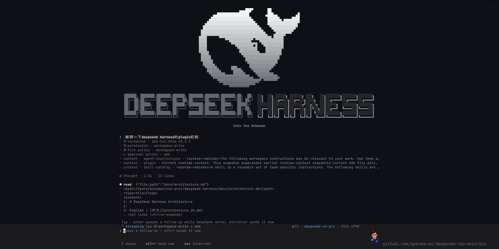

# dsh-tui — DEEPSEEK HARNESS, in the terminal

A [grok-build](https://github.com/xai-org/grok-build)-style terminal agent UI
for [DeepSeek Harness](https://github.com/deepseek-ai/deepseek-harness),
written in Rust (ratatui). It speaks the harness **SDK JSON-RPC stdio
protocol directly** — no Python SDK in the loop — and skins the whole thing
in the exact DeepSeek Web UI palette, whale included.

深度求索 · 探索未至之境 — *everything is a plugin.*



The whale is rasterized by `scripts/gen_logo.py` from the actual favicon SVG
shipped by the harness Web UI; the wordmark is figlet `ansi_shadow` tinted
like the whale's belly, with a white-edged hollow `HARNESS` when the terminal
is wide enough. Theme tokens in `src/theme.rs` are a 1:1 mapping of `--dsw-*`
variables from the Web UI's `design-platform.css` (dark and light, `/theme`
toggles).

## What it shows

Everything the Web UI surfaces for a session, live from the event stream:
streamed reasoning (collapsible `✻ thought · 3.2s · 14 lines`), streamed
assistant text, every tool call with arguments and results (`bash`,
`str_replace_editor`, `read`, …), injected plugin context, subagent
lifecycles, token usage incl. cache hits, turn end reasons, and runtime
state.

## Interactions (grok-build homage)

| Key | Behavior |
|---|---|
| `enter` | send · **queues a follow-up while a turn runs** (protocol-native inbox) |
| `alt+enter` | send-now: interrupt the turn, run this next |
| `esc` | interrupt (draft survives) · idle: `esc esc` clears the draft |
| `ctrl+c` | clear draft first · interrupt · `ctrl+c ctrl+c` quits |
| `↑` | prompt history (on an empty prompt) |
| `!cmd` | run a local shell command (client-side, not the agent) |
| `/` | slash menu with prefix filtering (`/help /new /model /mode /effort /permission /plan /theme /liang …`) |
| `ctrl+m` | model picker (host catalog) → reasoning-effort picker |
| `shift+tab` | cycle permission presets · `/permission` opens the picker |
| `ctrl+e` | expand all thoughts/tool output · `ctrl+t` theme · `ctrl+l` clear |
| `pgup/pgdn` `ctrl+u/d` | scroll · mouse wheel works · `end` follows the tail |
| mouse drag | select in the chat pane — **release copies** (选中即复制) · double-click copies a word |

Agent seams are real, not cosmetic: `/mode` picks the agent preset —
standard · code · minimal · creator (the host `agentPresets` roster in
plugin mode; composed on a session's first prompt), `/model` switches live
in plugin mode, `/effort off|high|max` sets reasoning effort for the
session, and `/plan` passes plan mode through to the host.

<p align="center">
  
</p>

Clipboard delivery is grok-pager-style routed legs that never hard-fail the
UI (`src/clipboard.rs`): native tool (`pbcopy` / `wl-copy` / `xclip` /
`xsel`) → tmux paste buffer → OSC 52 to the controlling terminal, wrapped in
a tmux passthrough envelope when needed — so copy works locally, in tmux,
and over SSH.

## The composer pet · `/liang` 🤫

A pixel-art **梁文锋** — affectionately, **小难梁** — perches on the
composer's right edge; `/liang` summons him. Two states, driven by the run
state:

| State | Sprite | Vibe |
|---|---|---|
| idle | 🤫 finger on lips | *quiet — he's thinking about AGI* |
| working | ⌨︎ hammering a tiny terminal | *a turn is streaming — 亲自上手* |

The meme, for the record: DeepSeek's famously low-profile founder — the
legend goes he still reads every paper and writes code between GPU runs —
so naturally he moonlights in your status corner, shushing the room while
the model thinks and typing furiously the moment a turn starts. 小难梁:
because 难 (hard problems) is the family business — AGI 很难，但他在加班.

Mechanics: the frames are real pixels (`assets/pet/liang-*.png`, RGBA,
transparent), placed with the **kitty graphics protocol** where the terminal
speaks it (ghostty · kitty · WezTerm, sniffed from `$TERM` /
`$TERM_PROGRAM`; one-shot transmit-and-display, re-sent on layout/state
changes — `src/pet.rs`). Terminals without pixel graphics get the XS
half-block whale from `logo_data.rs` instead, so the corner never goes
empty. `/liang` toggles him (also `/liang on|off`); he steps out on his own
below 60 columns.

## Install & run

Needs the harness runtime binary (`dsh-jsonrpc-agent`) — easiest source is
the Python wheel:

```sh
uv venv .venv && uv pip install --python .venv/bin/python deepseek-harness-runtime-bin
export DEEPSEEK_API_KEY=sk-...
cargo run --release            # or: target/release/dsh-tui
```

Runtime discovery order: `--runtime-bin` → `$DSH_RUNTIME_BIN` → a
`.venv`/`venv` wheel near the workspace/exe → `$DSB_HOME` →
`~/.deepseek-harness-tui` → `PATH`. No key? Try the full UI with scripted
turns: `dsh-tui --demo`.

```sh
dsh-tui --check-runtime        # raw protocol handshake, no TUI
dsh-tui --dump-frame 100x40    # render one demo frame as plain text
```

### npm

```sh
npm i -g @openma/deepseek-harness-tui@beta       # installs dsh-tui + dsb
```

Or build the package from source:

```sh
bash scripts/build-npm.sh
npm i -g ./dist/openma-deepseek-harness-tui-0.0.1-beta.tgz
```

### As a dsh plugin (profile bundle)

The same npm package doubles as a Cordis bundle for the official `dsh` CLI —
`dsh plugin` forwards to pnpm inside the profile directory (a workspace
root, hence `-w`):

```sh
dsh plugin --profile tui add -w @openma/deepseek-harness-tui   # or the local .tgz
dsh --profile tui
```

`dsh --profile tui --dump-config` should now show the bundle mounted under
the stable plugin id `tui-runner`.


`npm/lib/index.js` spawns the native binary on the host TTY and mounts the
official `@deepseek-ai/dsh-sdk-jsonrpc-server` with its transport redirected
over pipe fds 3/4 (`dsh-tui --attach-fds`), so the TUI speaks the identical
protocol in both modes while agent, tools, providers, and persistence come
from the dsh profile — the status line says `connected · dsh-tui-shim`, and
credentials truthfully read `host dsh (credential seam)`. Wire-tested by
`scripts/test-attach.mjs`. In plugin mode, mid-turn interrupt is not
available (the host owns the turn).

## Protocol

NDJSON JSON-RPC 2.0 over stdio (`src/proto.rs`):
requests `initialize` / `session/prompt` / `shutdown`; notifications
`session.event` (persistence-catalog events: `assistant/chunk`, `tool/call`,
`tool/result`, `turn/*`, `user/message`, …), `session.status`,
`subagent.started/finished`. Esc-interrupt in standalone mode kills the
runtime process — the durable JSONL session survives and the next prompt
respawns it with the same session id.

## Layout

```
src/proto.rs       NDJSON JSON-RPC client (spawn + attach transports)
src/runtime.rs     runtime binary / cordis config discovery
src/controller.rs  lifecycle thread: spawn, initialize, prompt, interrupt
src/events.rs      notifications → UiEvents (unit-tested)
src/transcript.rs  scrollback cells + wrapping + styling
src/app.rs         state machine & keys        src/ui.rs  drawing
src/theme.rs       Web UI design tokens        src/logo.rs + logo_data.rs
src/pet.rs         /liang — kitty-graphics pet (idle/working sprites)
src/clipboard.rs   routed copy: native tool → tmux buffer → OSC 52
src/demo.rs        scripted wire-identical turns for --demo
assets/pet/        Liang sprite frames         assets/screenshots/
assets/promo/      social card + build.py (composed from real pixels)
npm/               dual-mode package (CLI shim + dsh bundle plugin)
scripts/           gen_logo.py · build-npm.sh · test-attach.mjs
```

MIT. Not affiliated with DeepSeek or xAI; grok-build is the interaction
reference, deepseek-harness is the substrate.
