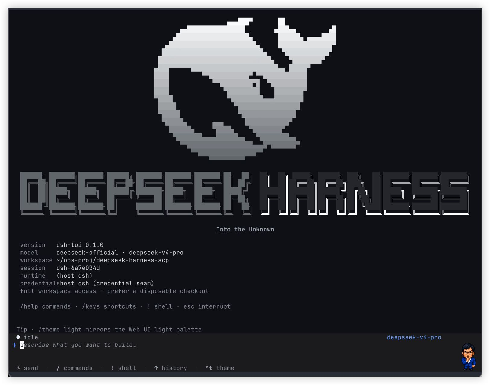
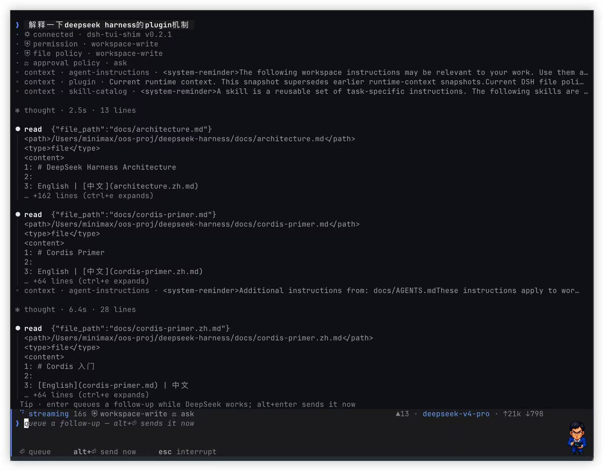
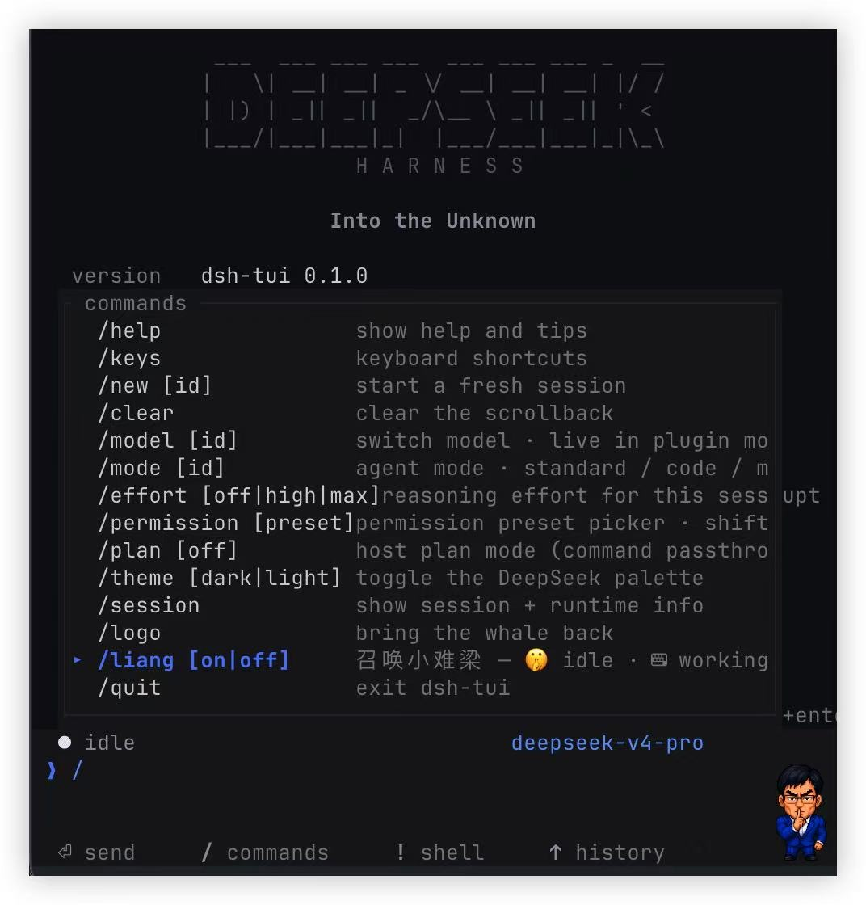

# dsh-tui

[中文](README.md) | [English](README.en.md)

[](https://www.npmjs.com/package/@openma/deepseek-harness-tui)
[](https://github.com/openma-ai/deepseek-harness-tui/actions/workflows/package-npm.yml)
[](LICENSE)

DeepSeek Harness 的终端原生 agent UI：在一个 Rust/ratatui 界面里查看流式推理、
工具调用、subagent、token 用量和持久化会话。既可以作为官方 `dsh` profile
插件运行，也可以直接连接 SDK JSON-RPC runtime。

> **v0.1.0** · 官方包覆盖 macOS Apple Silicon、macOS Intel、Linux x64 和
> Windows x64。当前集成以 `dsh 0.1.0-rc.6` 为基线。



## 快速开始

### 推荐：作为 dsh profile 插件运行

需要已安装并配置好的 `dsh`、Node.js 18+ 和 pnpm 10+。

```sh
dsh plugin --profile tui add @openma/deepseek-harness-tui
dsh --profile tui
```

安装命令不需要 `-w`。可用下面的命令确认 bundle 已挂载为 `tui-runner`：

```sh
dsh --profile tui --dump-config
```

### 先看 Demo

Demo 不需要 runtime 或 API key：

```sh
npm install --global @openma/deepseek-harness-tui
dsh-tui --demo
```

`dsh-tui` 是主命令；`dsb` 保留为兼容别名。

## 核心能力

- 实时呈现推理、回复、工具参数与结果、plugin 上下文和 subagent 生命周期。
- 回合进行中排队 follow-up；standalone 模式还支持立即打断并发送下一条。
- 持久化 JSONL 会话，可通过 `/new`、`/resume` 和 `--session-id` 管理。
- 从 dsh 宿主读取模型、agent preset、权限 preset、provider 和凭据。
- 深浅两套 DeepSeek Web UI 风格主题，支持窄终端与鼠标交互。
- 本机、tmux 和 SSH 下通过原生剪贴板、tmux buffer 或 OSC 52 复制文本。



## 两种运行模式

| | dsh plugin（推荐） | Standalone |
|---|---|---|
| Agent、工具与 provider | 来自 dsh profile | 来自独立 SDK runtime |
| 模型与 agent preset | 使用宿主真实目录，可在 TUI 中切换 | 使用启动参数或 runtime 配置 |
| 会话存储 | `~/.dsh/sessions` | `~/.dsh-tui/sessions`，可用 `--session-root` 修改 |
| 回合中断 | 宿主持有回合，不做硬中断 | `esc` 停止 runtime；会话日志保留 |
| Runtime 安装 | bundle 自带兼容层 | 需要 `dsh-jsonrpc-agent` |

Plugin runner 在宿主 TTY 上启动原生二进制，并通过 fd 3/4 提供一套与官方 SDK
server 兼容的 JSON-RPC 接口。它不是对
`@deepseek-ai/dsh-sdk-jsonrpc-server` 的直接挂载；agent、工具、provider 和持久化
仍由外围 dsh profile 提供。

### Standalone runtime

全局安装只提供 TUI 二进制。Standalone 模式还需要在工作区附近的 `.venv` 中
安装 DeepSeek Harness SDK，或显式指定 runtime：

```sh
python -m venv .venv
.venv/bin/pip install deepseek-harness-sdk
dsh-tui --workspace .
```

也可以设置 `DSH_RUNTIME_BIN`，或传入 `--runtime-bin <path>`。凭据优先使用
`--api-key`、`DEEPSEEK_API_KEY`，随后尝试读取本机 `~/.dsh` 配置。

## 常用交互

| 按键 / 命令 | 行为 |
|---|---|
| `enter` | 发送；回合运行时排队 follow-up |
| `alt+enter` | Standalone：打断当前回合并优先发送；plugin：排队 |
| `esc` | Standalone：打断且保留草稿；空闲时连按两次清草稿 |
| `ctrl+c` | 先清草稿，再中断；连按两次退出 |
| `/` | 打开命令菜单并按前缀过滤 |
| `/model` · `/mode` | 选择模型和 agent preset；完整目录需要 plugin 模式 |
| `/permission` · `shift+tab` | 选择或轮换权限 preset；需要 plugin 模式 |
| `/effort` · `/plan` | 设置推理力度或把 plan 模式传给宿主 |
| `ctrl+e` · `ctrl+t` | 展开输出 · 切换主题 |
| `pgup/pgdn` · `ctrl+u/d` | 滚动；`end` 回到实时尾部 |
| 鼠标拖选 | 松手复制；双击复制单词；`shift+拖选` 使用终端原生选择 |
| `!cmd` | 在客户端本地执行 shell 命令，不经过 agent |

界面内使用 `/help` 查看命令，使用 `/keys` 查看完整快捷键。

<p align="center">
  
</p>

<details>
<summary><strong>输入框宠物：/liang 🤫</strong></summary>

`/liang` 会在输入框右侧显示小难梁：空闲时安静思考，回合运行时敲小终端。
Ghostty、Kitty 和 WezTerm 等支持 kitty graphics protocol 的终端会显示 RGBA
像素精灵；其他终端退回半块字符鲸鱼。宽度低于 60 列时自动隐藏。

可用 `/liang on`、`/liang off` 显式控制。

</details>

## 从源码构建

需要 Rust stable 和 Node.js 18+：

```sh
cargo test --locked
node --test scripts/package-native.test.mjs
bash scripts/build-npm.sh
```

本地脚本只编译当前平台，并将 tarball 写入 `dist/`。GitHub Actions 工作流
`Package and publish npm` 会分别构建以下目录，再汇总为一个 npm 包：

```text
npm/vendor/darwin-arm64/dsh-tui
npm/vendor/darwin-x64/dsh-tui
npm/vendor/linux-x64/dsh-tui
npm/vendor/win32-x64/dsh-tui.exe
```

推送与 `npm/package.json` 和 `Cargo.toml` 版本一致的 tag（例如 `v0.1.0`）
会通过 npm Trusted Publishing（OIDC）发布到 `latest`，随后创建带 tarball
的 GitHub Release。版本不一致时 CI 会在发布前失败。

## 故障排查

- **`no native binary for ...`**：当前安装包不包含你的平台。确认安装的是
  最新版本，并查看上方支持矩阵。
- **`cannot find ... dsh-jsonrpc-agent`**：这是 standalone runtime 缺失；安装
  SDK、设置 `DSH_RUNTIME_BIN`，或改用 dsh plugin 模式。
- **pnpm workspace root 错误**：升级到 pnpm 10+，然后重新运行不带 `-w` 的
  安装命令。
- **像素宠物不显示**：终端可能不支持 kitty graphics protocol；主界面功能
  不受影响。

## 项目结构

- `src/`：TUI 状态机、绘制、协议、runtime 生命周期和会话目录。
- `npm/`：dsh bundle runner、CLI shim、manifest 与原生二进制。
- `scripts/`：本地构建、跨平台打包校验、协议集成测试与资源生成。
- `assets/`：截图、主题资源和可选宠物精灵。

协议是 stdio 上的 NDJSON JSON-RPC 2.0。实现细节可从
[`src/proto.rs`](src/proto.rs)、[`src/controller.rs`](src/controller.rs) 和
[`npm/lib/index.js`](npm/lib/index.js) 开始阅读。

## License

[MIT](LICENSE)。本项目与 DeepSeek、xAI 无关联；
[grok-build](https://github.com/xai-org/grok-build) 是交互设计参考，
[DeepSeek Harness](https://github.com/deepseek-ai/deepseek-harness) 是运行底座。
