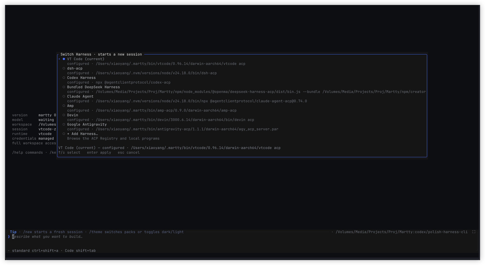
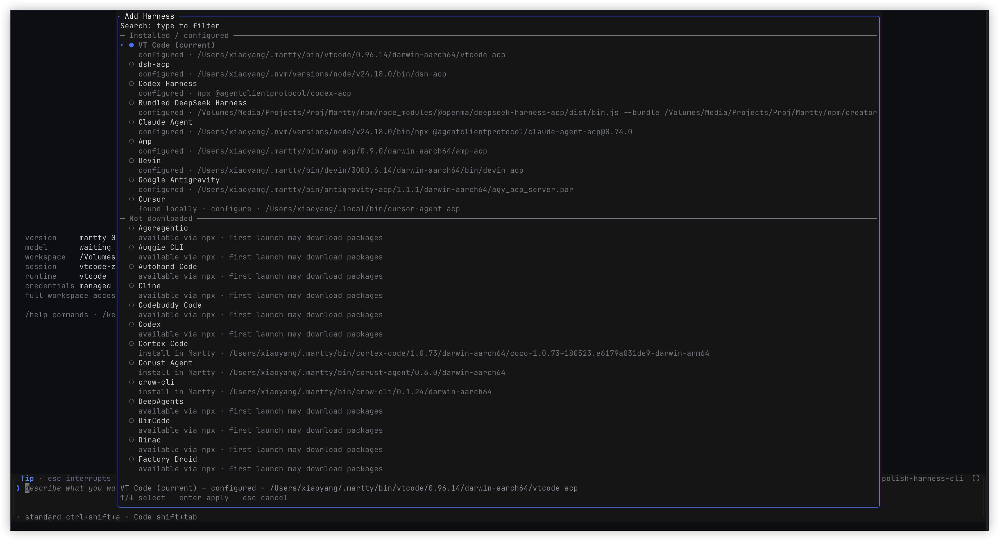

# Harness TUI 使用指南

在已经打开的 Martty 输入框执行 `/harness`，管理当前进程使用的 Harness。
需要从系统终端配置下次启动默认项时，参见 [CLI 使用指南](harness-cli.md)。

## 切换已配置的 Harness

输入 `/harness` 并按 Enter 打开切换菜单。当前 Harness 标为 `(current)`，固定在
最上方且不能重复选择。用 ↑ / ↓ 选中其他已配置项，再按 Enter 切换；无需再次添加。

还没发送过 prompt 的空会话会直接切换，并保持 landing 页。已经发送过 prompt 或恢复
历史会话时，会先询问是否开始新会话；确认后更换 ACP 进程，执行 `initialize` 和
`session/new`，不会把旧对话带入新 Harness。旧会话仍可从 `/session` 找回。

只有 ACP 就绪后才更新保存的 `defaultHarness`；失败时保留原默认项。
菜单的名称来自配置或 Registry，landing 的 `runtime` 当前来自 Agent 返回的内部名称，
两者可能不同，例如 Devin 的内部名称是 `affogato`。

## 添加新的 Harness

在切换菜单选择 **+ Add Harness…**，或直接输入 `/harness add`。无需先知道 Registry ID，
直接浏览目录或输入文字筛选，用 ↑ / ↓ 选择，再按 Enter 继续。

`Installed / configured` 分组包括已配置项和本地探测到的程序。`configured` 项被选中后
走正常切换流程；`found locally · configure` 会复用发现的路径并保存配置，配置本身不
自动切换。它们都不等于已经认证或具备运行所需的所有依赖。

`Not downloaded` 分组按条目提供的分发方式准备安装。npx/uvx 条目先显示下载确认，
binary 条目显示私有安装位置；确认后在进度面板下载。若缺少运行器，面板会提示所需
的 Node.js/npm 或 uv，并提供重新检测与手动配置入口。不要把“找到 npx”当成包已经下载。

目录先读取缓存或随包快照，本地探测与网络刷新在后台补充。`Catalog` / `checking local
installation…` 表示探测尚未完成；离线时仍可浏览已有目录。需要重试时选 **Refresh Registry**。

## 下载完成后切换

下载过程中 Enter 不关闭面板。Esc 隐藏进度面板，下载继续在后台进行，前提是 Martty
仍在运行；退出 Martty 会停止任务。完成或失败时 composer 会提示，可从 `/harness`
重新打开任务查看。

安装完成自动保存配置，但不会自行切换。完成面板中的 **Enter switch** 复用普通
`/harness` 选择的切换入口：已有对话时照常确认，之后照常连接、创建会话并处理认证。
**Esc close** 只关闭面板，当前 Harness 不变。下载失败时 Enter 重试下载；连接失败
与下载失败不同，不会因连接错误重复进入安装流程。

## 认证与错误处理

如果 Agent 要求登录，在 Martty 输入 `/auth`，选择它提供的认证方式并按面板提示操作。
网页登录、输入表单或终端认证是否可用，由该 Agent 声明。Agent 自己的 `/login`
命令仍归 Agent 处理，不等同于 Martty 的 `/auth`。

浏览器显示登录完成，不代表 ACP 请求已经成功；返回 Martty 后，以 `authenticate`
响应和后续会话状态为准。等待期间不要反复发起登录。需要查看当前连接与认证状态时
使用 `/status`。

失败面板直接显示 Agent 的错误原因、结构化错误数据及捕获的 stderr（如果存在）。
Enter 重试该操作；Esc 关闭，再用 `/harness` 选择其他项。不需要进入额外的错误详情菜单。
缺少可执行文件、依赖或账号资格时，需要先解决面板给出的原因，重复登录不一定能修复。

## 删除配置与返回上级

在 `/harness` 切换菜单选中要移除的已保存项，按 **Delete**。非搜索菜单中 Backspace
也触发删除入口；搜索框中的 Backspace 仍用于删字。当前运行项与产品强制项不能删除，
需要先切换到其他 Harness。也可以输入 `/harness remove` 选择目标。

先选择 **Remove configuration only**（仅删除配置，保留安装文件），或
**Remove configuration and private installation**（同时清理独占私有安装）。后者只有
资源所有权检查通过才可选。下一页列出配置文件和完整资源路径；检查后按 Enter 执行。
私有资源删除后需要重新下载；全局程序、共享缓存、历史和凭据保留。

删除确认页按 Esc 返回删除方式，保留刚才选择的方式；删除方式页按 Esc 返回来源菜单，
保留原 Harness 选中项。在最外层切换菜单按 Esc 才关闭。返回操作不删除配置或文件，
也不切换 Harness。这条逐级返回规则针对删除流程，不代表所有面板都有同样的层级。
